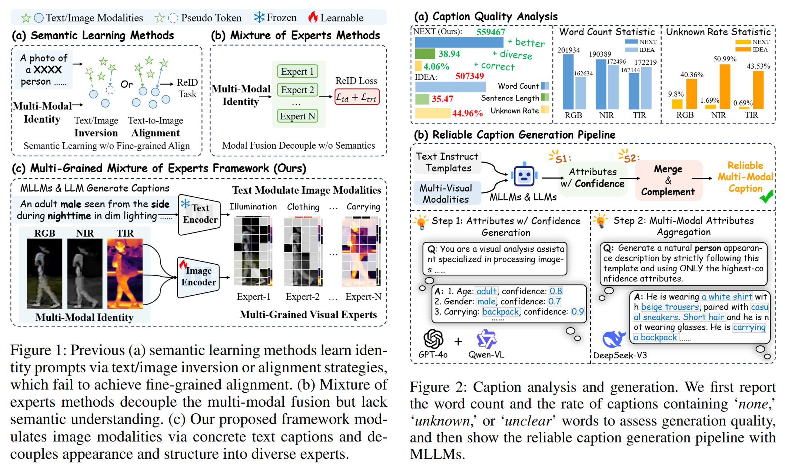
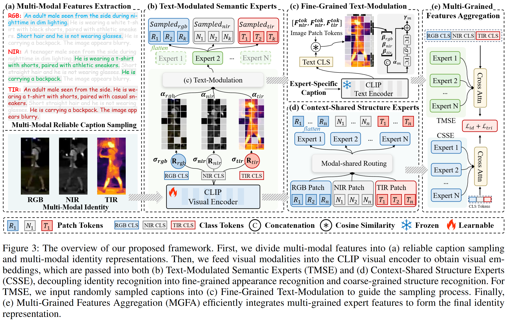
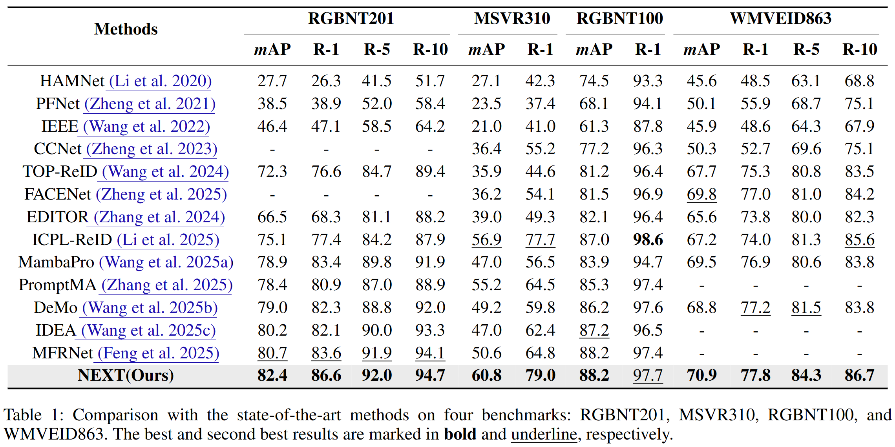

# NEXT: Multi-Grained Mixture of Experts via Text-Modulation for Multi-Modal Object Re-Identification
Official PyTorch implementation of the paper:


**"NEXT: Multi-Grained Mixture of Experts via Text-Modulation for Multi-Modal Object Re-Identification"**  
Authors: [Shihao Li, Aihua Zheng, Andong Lu, Jin Tang, Jixin Ma].

*The source Code will be completely released after being reorganized.*

[[Paper]](https://arxiv.org/pdf/2505.20001v4) 

---

## 📌 Proposed Method

 <!-- optional -->

**Abstract.** Multi-modal object Re-Identification (ReID) aims to obtain accurate identity features across heterogeneous modalities. However, most existing methods rely on implicit feature fusion modules, making it difficult to model fine-grained recognition patterns under various challenges in real world. Benefiting from the powerful Multi-modal Large Language Models (MLLMs), the object appearances are effectively translated into descriptive captions. In this paper, we propose a reliable caption generation pipeline based on attribute confidence, which significantly reduces the unknown recognition rate of MLLMs and improves the quality of generated text. Additionally, to model diverse identity patterns, we propose a novel ReID framework, named NEXT, the Multi-grained Mixture of Experts via Text-Modulation for Multi-modal Object Re-Identification. Specifically, we decouple the recognition problem into semantic and structural branches to separately capture fine-grained appearance features and coarse-grained structure features. For semantic recognition, we first propose a Text-Modulated Semantic Experts (TMSE), which randomly samples high-quality captions to modulate experts capturing semantic features and mining inter-modality complementary cues. Second, to recognize structure features, we propose a Context-Shared Structure Experts (CSSE), which focuses on the holistic object structure and maintains identity structural consistency via a soft routing mechanism. Finally, we propose a Multi-Grained Features Aggregation (MGFA), which adopts a unified fusion strategy to effectively integrate multi-grained experts into the final identity representations. Extensive experiments on four public datasets demonstrate the effectiveness of our method and show that it significantly outperforms existing state-of-the-art methods.

 <!-- optional -->
 <!-- optional -->
---

### 📖 Citation

If you find our work helpful, please consider citing:

```
@article{li2025next,
  title={NEXT: Multi-Grained Mixture of Experts via Text-Modulation for Multi-Modal Object Re-Identification},
  author={Shihao Li, Aihua Zheng, Andong Lu, Jin Tang, Jixin Ma},
  journal={arXiv preprint arXiv:2505.20001},
  year={2025}
}
```

### 🌺 Thanks
The code is built upon [DeMo](https://github.com/924973292/DeMo) and [IDEA](https://github.com/924973292/IDEA). Thanks for their excellent contributions!

### 📬 Contact
For questions or clarifications, feel free to contact:

📧 shli0603@foxmail.com, ahzheng214@foxmail.com
